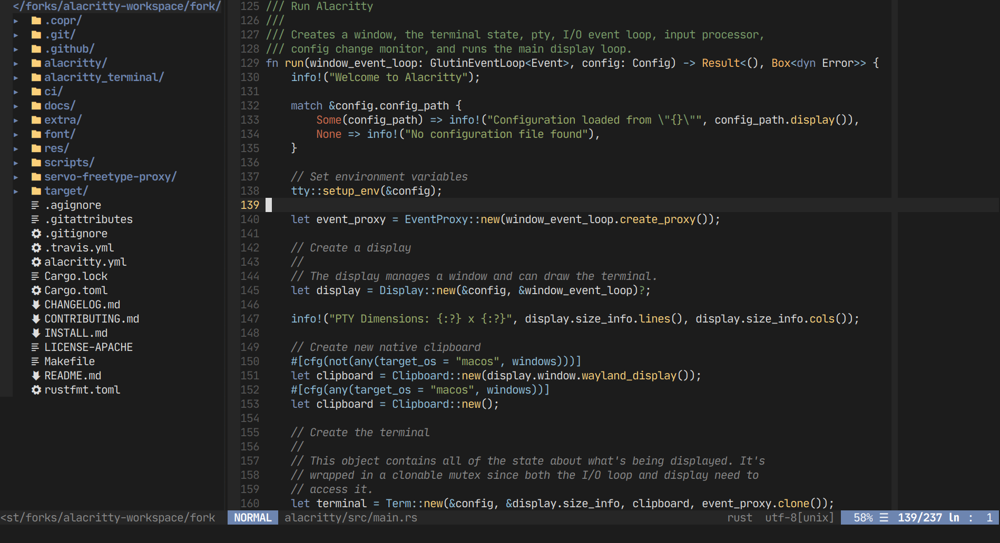

# vim-scythe

<p align="center">
 
</p>

scythe is a dark colorscheme based on jellybeans.

## Installation

`vim-plug`

```vim
  Plug 'kchibisov/vim-scythe'
  colorscheme scythe
```

## Configuration

scythe was designed to work well without `set termguicolors`, however it supports
the mentioned option.

The expected color configuration in your terminal so that this colorscheme works
correctly, without the `set termguicolors`:

```yaml
# background and foreground
background: '#1c1c1c'
foreground: '#dddddd'

# (0 - 7) indices
normal:
  black:   '#1c1c1c'
  red:     '#bf5e40'
  green:   '#799d6a'
  yellow:  '#ffb964'
  blue:    '#6d85b0'
  magenta: '#baa6ed'
  cyan:    '#9fbacb'
  white:   '#dddddd'

# (8 - 15) indices
bright:
  black:   '#888888'
  red:     '#cf6a4c'
  green:   '#99ad6a'
  yellow:  '#fad07a'
  blue:    '#8197bf'
  magenta: '#c6b6ee'
  cyan:    '#8fbfdc'
  white:   '#ffffff'
```

However, to get even better results, it's recommended that you change the
following indexed colors:

```yaml
# (22, 23, 24, and 52 indices)
color22: '#052200'
color23: '#0e3337'
color24: '#405963'
color52: '#442220'
```
